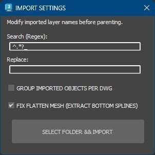

# DWG Mass Importer  

## Mass import of dwg files to 3Ds Max  

  

file_A: imported_dwg_A.dwg  
file_B: imported_dwg_B.dwg  

both files contains: child_shared  

each contains unique layer: child_uniqie_A or child_uniqie_B  

layers tree:  

	imported_dwg_A > imported_dwg_A - child_shared  
	imported_dwg_B > imported_dwg_B - child_shared  
	imported_dwg_A > child_uniqie_A  
	imported_dwg_B > child_uniqie_B  

for e.g.: NEVER MIX PERFIXES of "A" and layers of "B"  